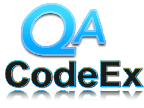

#QA Coding Exercise
 
The agile testing coding exercise is designed to demonstrate an agile tester's ability to use an IDE, write code, do OOD, refactor, test-drive, learn open-source automated testing frameworks and tools and generally be productive pairing with developers on agile teams. 

Along the way, other attributes indirectly tested include natural curiosity, passion, autodidacticism, courage, leadership, communication skills, and attention to detail. 

###Getting Started

To get started with the exercise, you will need to have:
  
* Something to edit Java code (such as the Eclipse IDE)
* Java 1.8
* Apache Maven
* Firefox v55 - v56
* Apache JMeter

 
Download and install Maven and Eclipse.  Clone this Git Repository to your local machine or download as a zip from Github.  Once you have downloaded or cloned the project locally, import into Eclipse as a Maven Project to get started.

###Once You are Finished

When complete, please export as a java project and send it back in a zip / archive file format.

rev. 11/2017